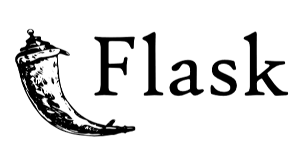
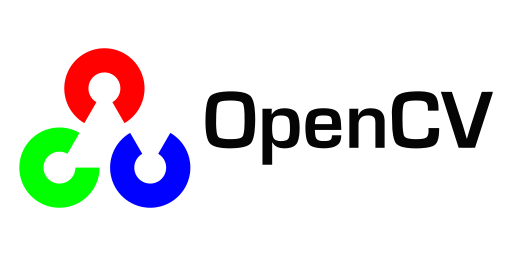
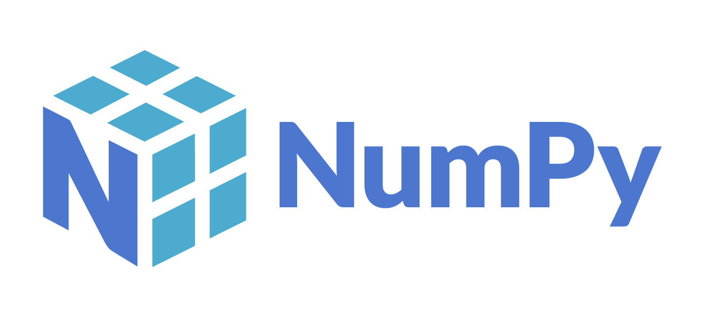
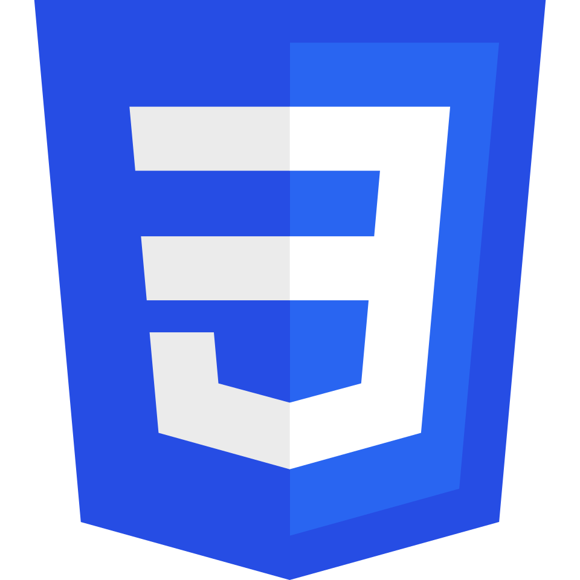
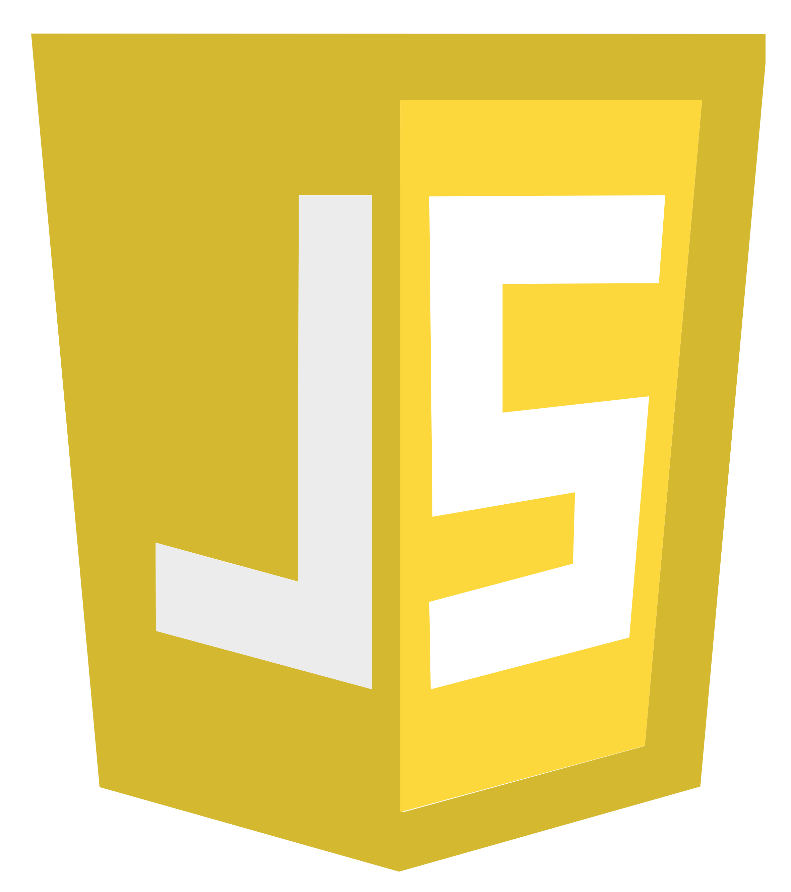

<h1 align="center">

**VISION-BASED WALL AREA ESTIMATION FOR A ROBOTIC PAINT COATER**

</h1>

<div align="center">
<i>Backend & Computer Vision</i>
<br>
     
  
  
  
<br>
<i>Object Detection & Segmentation</i>
<br><br>
  
<br><br>
<i>Frontend</i>
<br>
  
  
  
</div>

<br>

<p align="center">

*A computer vision-powered application that detects, segments, estimates the wall area, and automatically calculates the volume of the paint.*

</p>

<br>

## 📌 OVERVIEW

A computer vision system that detects and segments wall surfaces from images, estimates the paintable area, and computes the requuired paint volume, removing the need for manual measurement.

This system is built using **Python (Flask)** for the backend, **HTML and CSS** for the frontend, and **YOLOv11** for both object detection and image segmentation.

> **⚠️NOTE⚠️**
>
> *This repository contains only the software component of the project design.*
>
> *The full system also includes hardware components which is not covered here.*

<br>

## **✨ HIGHLIGHTS**

*   🔍 Wall detection and segmentation using YOLOv11
*   📐 Wall area estimation from a single image
*   🎨 Paint volume calculator based on estimated surface area
*   🌐 Lightweight interface built with Flask + HTML/CSS
*   📷 Supports both image upload and live camera input

<br>

## **🎬 DEMONSTRATION**

> *📽️ Demo GIF coming soon*

<br>

## **🎯 USE CASE**

|Use Case|Description|
|---|---|
|💰*Cost Estimation*|Helps painters and clients get accurate material cost estimates without manual measuring|
|🏢*Residential Painting*|Estimates the wall area in homes to calculate exact paint needed before starting|

<br>

## **🛠️ TECH STACK**

|LAYER|TECHNOLOGY|
|-----|-----|
|Frontend|HTML, CSS|
|Backend|PYTHON (Flask) |
|Database|SQL|
|Object Detection|YOLOv11|
|Image Segmentation|YOLOv11|

<br>

## **📁 PROJECT STRUCTURE**

```
├── /frontend
├── /backend
├── /database
├── /model
├── /demo
├── /docs
├── /LICENSE
└── README.md
```

<br>

## **👨‍💻 ACADEMIC INFO**

|**FIELD**|**DETAILS**|
|---|---|
|Institution|Technological Institute of the Philippines - Quezon City|
|Program| BS Computer Engineering <br> *Specialized in Data Science*|
|Year|2025|
|Role|Computer Vision Developer <br> Full Stack Developer|

<br>

## 📄 LICENSE

This project is open for viewing and learning purposes.

Licensed under the [MIT License](LICENSE) © 2025 Tricha Maie Canja et al.
